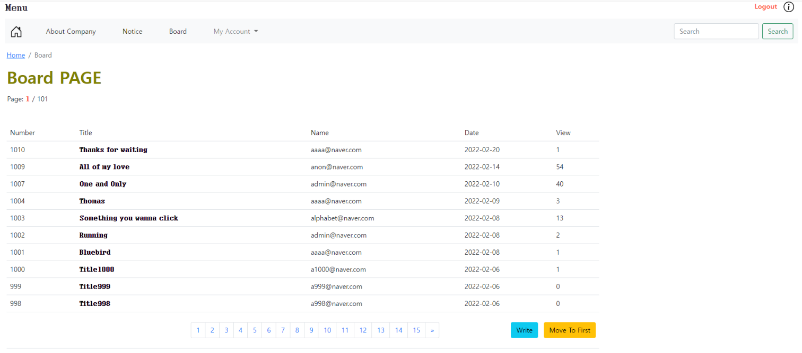
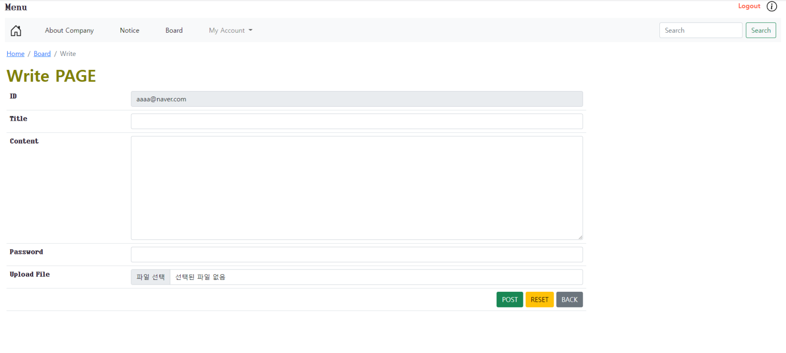

# BoardProject
- 게시판을 만드는 프로젝트로 글을 읽고 쓰고 수정하고 삭제할 수 있습니다. 
- 파일을 올릴 수 있도록 하여 다른 유저가 올린 파일을 다운로드할 수 있도록 구현했습니다.
- 또한 로그인과 로그아웃 기능도 구현하였습니다.

# Board Images

## Program Stacks
- Java
- HTML
- CSS
- JavaScript
- BootStrap5

# After Work
- Java 언어를 주력으로, JSP/Servlet, JavaScript 등 다양한 프로그래밍 언어를 사용함으로써 각각의 언어에 대한 이해도를 높일 수 있었습니다.
- 또한 DB와 Eclipse를 연결함으로써 데이터를 저장할 수 있게 설정했는데, 본 과정을 통해 MySQL DBMS를 더욱 잘 활용할 수 있게 되었습니다.
- MVC2 패턴을 사용해 해당 게시판을 구현했는데, 이에 대한 생산성을 더욱 높일 수 있는 Java의 Spring 프레임워크도 현재 배우고 있는 중입니다.
- 항상 현재보다 내일 더 나은 개발자가 되기 위해 노력하고 있습니다.
